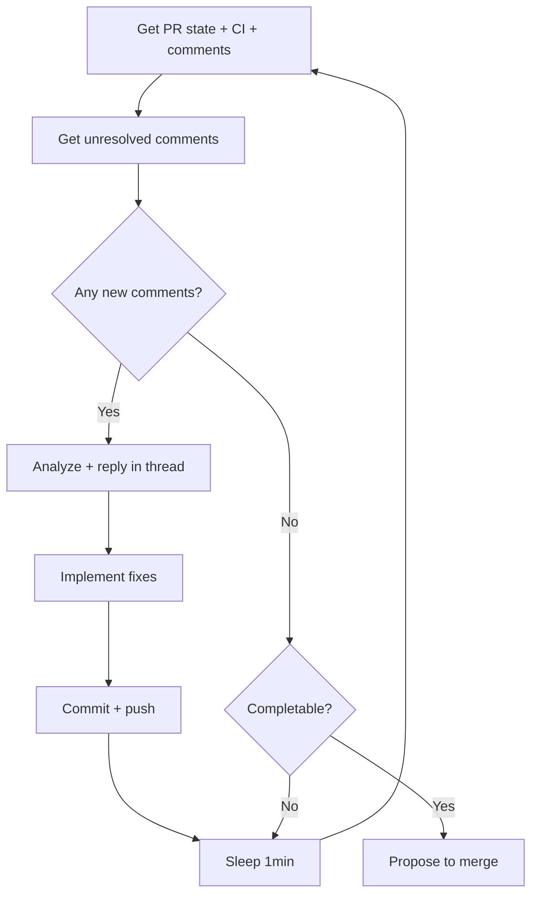

# code:pr-review

Review a pull request, address feedback, and iterate until the PR is completable (approved with no unresolved comments).

## Usage

```bash
/code:pr-review <projectName> <workitem>
```

**Arguments:**
- `projectName` - Project name from registry (e.g., "DGD")
- `workitem` - Work item identifier (e.g., "KAN-4")

## Workflow

This skill implements a polling loop that monitors PR state and addresses feedback automatically:

1. **Navigate to worktree** - CD into the worktree on branch `feature/{workitem}`
2. **Get PR** - `gh pr view` automatically detects PR from current branch
3. **Poll every 1 minute:**
   - Fetch PR state, CI checks, and unresolved comments
   - Analyze new unresolved comments
   - Reply in-thread for auto-fixable comments
   - Implement fixes, commit, push
   - Check completability (approved + CI passing + no unresolved comments)
4. **Determine completability:**
   - ✅ **Completable** → Propose to merge
   - ❌ **Not completable** → Sleep 1min, continue polling

### Polling Loop



## Implementation

### 1. Get Project and Worktree

```bash
# Get project
PROJECT=$(bun run ~/Projects/yaaf/project-registry/get.ts projectName="{projectName}")
REPO_PATH=$(echo "$PROJECT" | jq -r '.path')

# Get worktree path (created by /code:implement)
WORKTREE_PATH="$REPO_PATH/worktrees/{projectName}-{workitem}"

# Navigate to worktree (already on feature/{workitem} branch)
cd "$WORKTREE_PATH"
```

### 2. Get PR from Current Branch

Since we're in the worktree on branch `feature/{workitem}`, `gh` automatically detects the PR:

```bash
# gh pr view detects PR from current branch
PR_DATA=$(gh pr view --json number,state,reviewDecision,reviews,comments 2>&1)

# Check if PR exists
if [ $? -ne 0 ]; then
  echo "❌ No PR found for branch feature/{workitem}"
  echo ""
  echo "This work item has no associated pull request."
  echo ""
  echo "Run /code:implement to implement and create the PR:"
  echo "  /code:implement {projectName} {workitem}"
  exit 1
fi

PR_NUMBER=$(echo "$PR_DATA" | jq -r '.number')
```

### 3. Start Polling Loop

```bash
# Poll every 1 minute until completable
ITERATION=0
MAX_ITERATIONS=60  # 60 minutes max

while [ $ITERATION -lt $MAX_ITERATIONS ]; do
  echo "📊 Iteration $((ITERATION + 1)): Checking PR state..."

  # Get fresh PR data
  PR_DATA=$(gh pr view --json number,state,reviewDecision,reviews,comments)

  STATE=$(echo "$PR_DATA" | jq -r '.state')
  REVIEW_DECISION=$(echo "$PR_DATA" | jq -r '.reviewDecision')

  # Continue to step 4...
done
```

### 4. Get Unresolved Comments

```bash
# Get only unresolved comments (these need action)
UNRESOLVED=$(gh pr view --json comments \
  --jq '[.comments[] | select(.isResolved == false)]')

# Count unresolved comments
UNRESOLVED_COUNT=$(echo "$UNRESOLVED" | jq 'length')

if [ "$UNRESOLVED_COUNT" -eq 0 ]; then
  echo "✅ No unresolved comments"
else
  echo "📝 Found $UNRESOLVED_COUNT unresolved comment(s)"
fi
```

### 5. Analyze and Reply to Comments

For each unresolved comment, determine if it's auto-fixable:

```bash
# Parse each comment
echo "$UNRESOLVED" | jq -c '.[]' | while read -r comment; do
  COMMENT_ID=$(echo "$comment" | jq -r '.id')
  COMMENT_BODY=$(echo "$comment" | jq -r '.body')
  AUTHOR=$(echo "$comment" | jq -r '.author.login')

  # Check if we already replied (skip if yes)
  HAS_REPLY=$(gh api "/repos/{owner}/{repo}/pulls/comments/$COMMENT_ID" \
    --jq '.comments // [] | any(.user.login == "github-actions[bot]" or .user.login == env.GITHUB_USER)')

  if [ "$HAS_REPLY" = "true" ]; then
    continue  # Already addressed
  fi

  # Analyze if auto-fixable
  # (Use Claude to determine if the comment is actionable)
  # If YES: Reply in thread

  gh api "/repos/{owner}/{repo}/pulls/comments/$COMMENT_ID/replies" \
    -f body="🤖 I'll address this by: [explain what will be done]"
done
```

**Auto-fixable examples:**
- Linter errors (ESLint, Prettier) → ✅ Auto
- Type errors → ✅ Auto
- Missing null checks → ✅ Auto
- "Add tests" → ✅ Auto (if straightforward)
- "Why did you do X?" → ❌ Needs human

### 6. Implement Fixes

After replying to comments, implement all auto-fixable changes:

```bash
# Use Claude to read comments and implement fixes
# Work in the worktree (already on correct branch)

# Commit changes if any
if [ -n "$(git status --porcelain)" ]; then
  git add .
  git commit -m "Address PR feedback: [summary of changes]"
  git push
  echo "✅ Pushed fixes, waiting for CI..."
fi
```

### 7. Check CI Status

```bash
# Get CI check runs
CHECKS=$(gh pr checks --json state,name)
ALL_PASSED=$(echo "$CHECKS" | jq 'all(.state == "SUCCESS")')
PENDING=$(echo "$CHECKS" | jq '[.[] | select(.state == "PENDING")] | length')

if [ "$ALL_PASSED" = "false" ] || [ "$PENDING" -gt 0 ]; then
  echo "⏳ CI still running or failed, waiting..."
  # Continue polling
fi
```

### 8. Determine Completability

```bash
# Completable if ALL conditions met:
# 1. State is OPEN
# 2. Review is APPROVED
# 3. No unresolved comments
# 4. All CI checks passed

if [ "$STATE" = "OPEN" ] && \
   [ "$REVIEW_DECISION" = "APPROVED" ] && \
   [ "$UNRESOLVED_COUNT" -eq 0 ] && \
   [ "$ALL_PASSED" = "true" ]; then
  echo "✅ PR is completable!"
  # Propose to complete (see step 9)
  break  # Exit polling loop
else
  echo "❌ Not completable yet:"
  echo "   State: $STATE"
  echo "   Review: $REVIEW_DECISION"
  echo "   Unresolved: $UNRESOLVED_COUNT"
  echo "   CI: $([ "$ALL_PASSED" = "true" ] && echo "✅" || echo "❌")"
  echo ""
  echo "⏳ Sleeping 1 minute before next check..."
  sleep 60
  ITERATION=$((ITERATION + 1))
fi
```

### 9. Propose to Complete

When completable (breaks out of polling loop), ask user:

```
✅ PR #123 is ready to complete!

State: OPEN
Review: APPROVED
Unresolved comments: 0
CI checks: ✅ All passed

Options:
1. Merge PR (squash)
2. Exit (manual merge)

What would you like to do?
```

**If merge:**
```bash
gh pr merge "$PR_NUMBER" --squash --delete-branch
echo "✅ PR merged and branch deleted"
```

## Examples

### Example 1: Polling with feedback loop

```bash
/code:pr-review DGD KAN-4
```

**Output:**
```
📊 Iteration 1: Checking PR state...
📝 Found 2 unresolved comment(s)

Comment from @reviewer: "Please add error handling to the form submission"
🤖 Replying: "I'll address this by adding try-catch and error toast"

Comment from @reviewer: "Missing tests for AppSidebar"
🤖 Replying: "I'll add unit tests for the component"

Implementing fixes...
✅ Pushed fixes, waiting for CI...

❌ Not completable yet:
   State: OPEN
   Review: CHANGES_REQUESTED
   Unresolved: 2
   CI: ⏳

⏳ Sleeping 1 minute before next check...

📊 Iteration 2: Checking PR state...
⏳ CI still running (3/5 checks passed)...

⏳ Sleeping 1 minute before next check...

📊 Iteration 3: Checking PR state...
✅ No unresolved comments
✅ CI: All checks passed
✅ Review: APPROVED

✅ PR #123 is ready to complete!

Options:
1. Merge PR (squash)
2. Exit (manual merge)

[User selects 1]

✅ PR #123 merged and branch deleted
```

### Example 2: Non-auto-fixable comments

```bash
/code:pr-review DGD KAN-4
```

**Output:**
```
📊 Iteration 1: Checking PR state...
📝 Found 1 unresolved comment(s)

Comment from @reviewer: "Why did you choose this approach instead of using the existing utility?"

❓ This comment requires human input (design decision)

❌ Not completable yet (needs human response)

Exiting polling loop. Please respond to comments manually.
```

## Detailed Guide

For implementation details, see [references/implementation.md](references/implementation.md)

## Notes

- **Polling loop:** Checks PR state every 1 minute (max 60 iterations = 1 hour)
- **Unresolved comments only:** Uses GitHub's resolved/unresolved status to track progress
- **In-thread replies:** Replies directly to comments to show what will be fixed
- **CI-aware:** Waits for CI checks to pass before declaring completable
- **Git/GitHub only:** No dependency on work item tracking system (Jira, etc.)
- **Worktree-based:** Uses existing worktree from /code:implement (must be on branch `feature/{workitem}`)
- **Branch convention:** Assumes branch name is `feature/{workitem}`
- **Auto-fix detection:** Analyzes comments to determine if they're auto-fixable
- **HITL for merge:** User controls when to merge, but feedback loop is automatic
- **Graceful exit:** Stops polling if comments require human input
